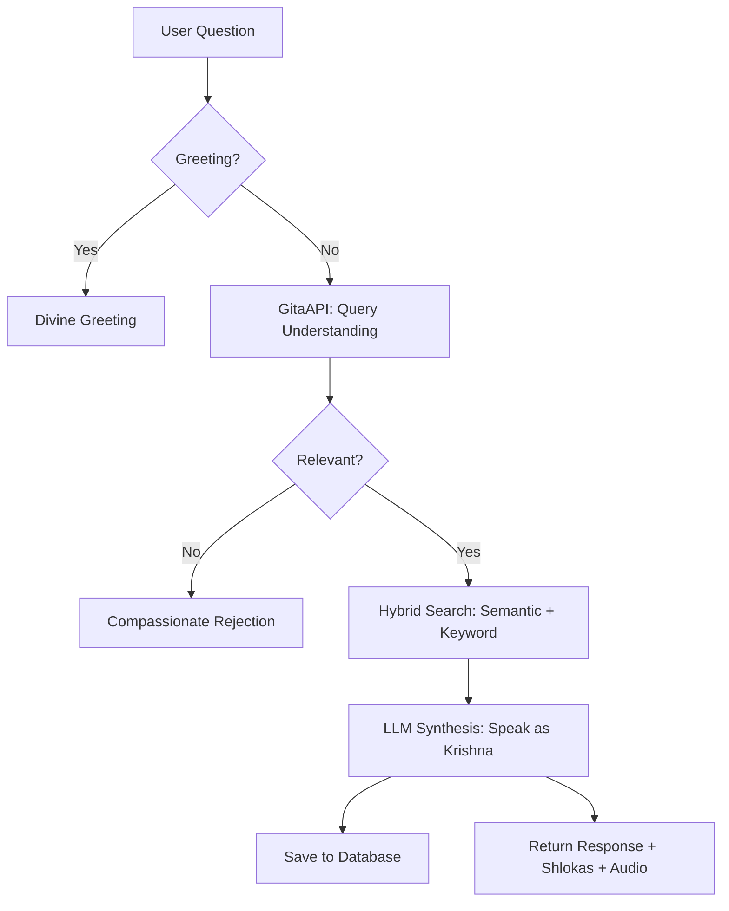

# Talk to Krishna: Response Architecture & Processing Pipeline

This document provides a detailed, step-by-step summary of how a user's question is processed in the "Talk to Krishna" application, from the moment a question is asked until the final response is delivered.

---

## 1. Request Ingestion (API Layer)
When a user types a question in the React frontend and clicks send, the following happens:
*   **Endpoint**: A `POST` request is sent to `/api/ask`.
*   **Validation**: The backend (`api_server.py`) validates the payload, ensuring the question is not empty.
*   **Greeting Check (Fast-Track)**: Before hitting any heavy logic, the system runs a regex-based greeting check (Hinglish/Hindi/English). If it's a simple "Hi" or "Jai Shri Krishna", it immediately returns a preset divine greeting, bypassing the AI search to save time.

---

## 2. Neural Processing (GitaAPI Logic)
If the question is a real query, it enters the `GitaAPI` RAG (Retrieval-Augmented Generation) pipeline:

### Phase A: Query Understanding (The Gatekeeper)
*   **Translation & Rephrasing**: The query (often Hinglish/Hindi) is sent to an LLM (Groq) to understand its core intent. It gets translated into English for accurate semantic matching.
*   **Relevance Check**: The system checks if the question is related to life problems, spirituality, or the Bhagavad Gita. Irrelevant questions (e.g., about sports or politics) are politely rejected here.
*   **Sentiment Analysis**: The AI detects the user's emotional state (e.g., Crisis, Distress, Curious, Angry) to set the "Tone" of Krishna's voice later.

### Phase B: Hybrid Retrieval (Finding the Truth)
The system searches for the most relevant Shlokas using two methods simultaneously:
1.  **Semantic Search (Vector Search)**: Uses the English-optimized embedding model to find verses that match the *meaning* of the question.
2.  **Keyword Search**: Uses specialized context mapping (e.g., mapping "Exam stress" or "Breakup" to specific relevant verses) to ensure accuracy even if semantic similarity is low.
*   **Narrative Filtering**: Verses spoken by characters like Sanjay or Dhritarashtra are slightly penalized to prioritize Krishna's direct words.

---

## 3. Divine Response Generation (LLM Synthesis)
The top retrieved Shlokas (usually 3-5) and the user's conversation history are sent to the `LLMAnswerGenerator`:
*   **Prompt Engineering**: A complex System Prompt instructs the AI to speak as **Lord Krishna**, using a tone appropriate to the detected emotional state (Gentle, Firm, Compassionate, etc.).
*   **Synthesis**: The LLM synthesizes an answer that:
    1.  Uses the wisdom of the specific Shlokas found.
    2.  Provides actionable life guidance.
    3.  Maintains the divine persona of Krishna.
*   **Repetition Control**: Frequency and presence penalties are applied to ensure the response sounds natural and not robotic.

---

## 4. Post-Processing & Delivery
*   **Audio Generation (Parallel)**: If audio is enabled, the synthesis text is sent to a text-to-speech engine asynchronously. The API returns the text answer immediately while the audio is processed.
*   **Persistence**: The conversation (Question, Krishna's Answer, and the Shloka IDs) is saved to the PostgreSQL/SQLite database for history retrieval.
*   **Metadata**: The response includes the full Sanskrit Shlokas and their meanings to be displayed in the UI below the message.

---

## 5. UI Rendering
*   **Bubble Animation**: The frontend displays the typing effect.
*   **Shloka Cards**: The relevant verses appear as "Contextual Wisdom" cards.
*   **Audio Feedback**: Krishna's voice begins to play if available.

---

### Summary Diagram

